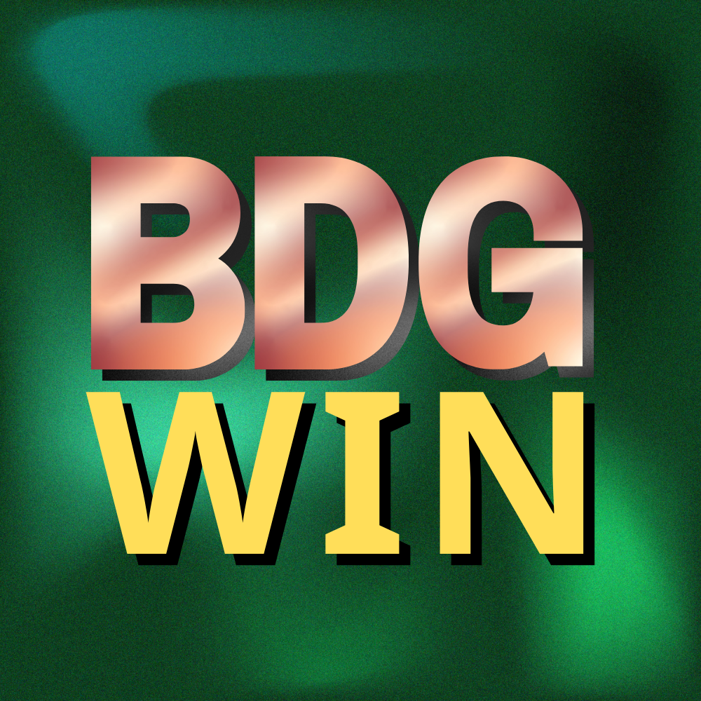
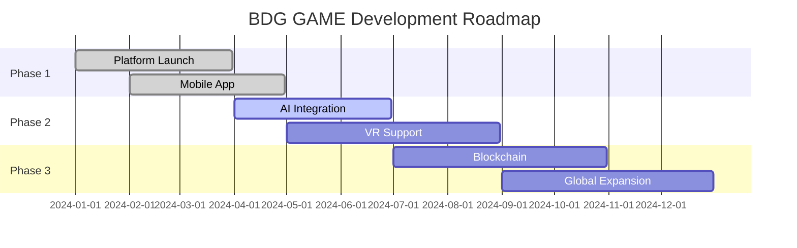

<div align="center">

# 🎮 BDG GAME

**Professional Gaming Platform | 专业游戏平台**

[](https://bdggame.com)
[](LICENSE)
[](https://github.com/BDGGAMEwin/BDGgame/stargazers)
[](https://github.com/BDGGAMEwin/BDGgame/network/members)



*Delivering exceptional gaming experiences with cutting-edge technology*

</div>

---

## 🌟 About BDG GAME

BDG GAME is a state-of-the-art gaming platform designed to provide users with secure, fair, and engaging entertainment experiences. Our platform combines innovative technology with user-centric design to create an unparalleled gaming environment.

### ✨ Key Features

<table>
<tr>
<td width="50%">

#### 🔐 **Security First**
- Advanced encryption protocols
- Secure payment processing
- Data protection compliance
- Regular security audits

#### 🎯 **Rich Gaming Library**
- Diverse game categories
- Regular content updates
- High-quality graphics
- Smooth gameplay experience

</td>
<td width="50%">

#### ⚡ **Performance Optimized**
- Lightning-fast loading times
- Responsive design
- Cross-platform compatibility
- 99.9% uptime guarantee

#### 🌍 **Global Reach**
- Multi-language support
- 24/7 customer service
- Worldwide accessibility
- Local payment methods

</td>
</tr>
</table>

---

## 🚀 Quick Start

### For Users

1. **Visit Our Platform** 🌐
   ```
   Navigate to our official website
   ```

2. **Create Account** 📝
   ```
   Sign up with your email address
   Complete verification process
   ```

3. **Explore Games** 🎮
   ```
   Browse our game library
   Choose your favorite games
   ```

4. **Start Playing** 🎯
   ```
   Begin your gaming journey
   Enjoy premium features
   ```

### For Developers

```bash
# Clone the repository
git clone https://github.com/BDGGAMEwin/BDGgame.git

# Navigate to project directory
cd BDGgame

# Install dependencies
npm install

# Start development server
npm run dev
```

---

## 🛠️ Technology Stack

<div align="center">

| Frontend | Backend | Database | Cloud |
|:--------:|:-------:|:--------:|:-----:|
|  |  |  |  |
|  |  |  |  |
|  |  |  |  |

</div>

---

## 📊 Platform Statistics

<div align="center">

| Metric | Value |
|:------:|:-----:|
| 🎮 **Active Games** | 500+ |
| 👥 **Registered Users** | 1M+ |
| 🌍 **Countries Served** | 50+ |
| ⭐ **User Rating** | 4.8/5 |
| 🔄 **Daily Transactions** | 100K+ |
| 📱 **Mobile Users** | 75% |

</div>

---

## 🎯 Roadmap



---

## 🤝 Contributing

We welcome contributions from the community! Please read our [Contributing Guidelines](CONTRIBUTING.md) before submitting pull requests.

### Development Process

1. **Fork** the repository
2. **Create** a feature branch (`git checkout -b feature/amazing-feature`)
3. **Commit** your changes (`git commit -m 'Add amazing feature'`)
4. **Push** to the branch (`git push origin feature/amazing-feature`)
5. **Open** a Pull Request

---

## 📞 Support & Contact

<div align="center">

### 🌐 Official Channels

[](https://bdggame.com)
[](mailto:support@bdggame.com)
[](https://docs.bdggame.com)

### 💬 Community

[](https://discord.gg/bdggame)
[](https://t.me/bdggame)
[](https://twitter.com/bdggame)

</div>

---

## 📄 Legal & Compliance

- 📋 [Terms of Service](https://bdggame.com/terms)
- 🔒 [Privacy Policy](https://bdggame.com/privacy)
- 🛡️ [Security Policy](SECURITY.md)
- ⚖️ [Code of Conduct](CODE_OF_CONDUCT.md)
- 🎯 [Responsible Gaming](https://bdggame.com/responsible-gaming)

---

## 📈 Analytics & Performance

<div align="center">


</div>

---

## 📜 License

This project is licensed under the MIT License - see the [LICENSE](LICENSE) file for details.

---

<div align="center">

### 🎮 **BDG GAME** - *Where Gaming Meets Excellence*

**Made with ❤️ by the BDG GAME Team**

*© 2024 BDG GAME. All rights reserved. This project complies with all applicable laws and regulations.*

---

⭐ **Star this repository if you find it helpful!** ⭐

</div>
